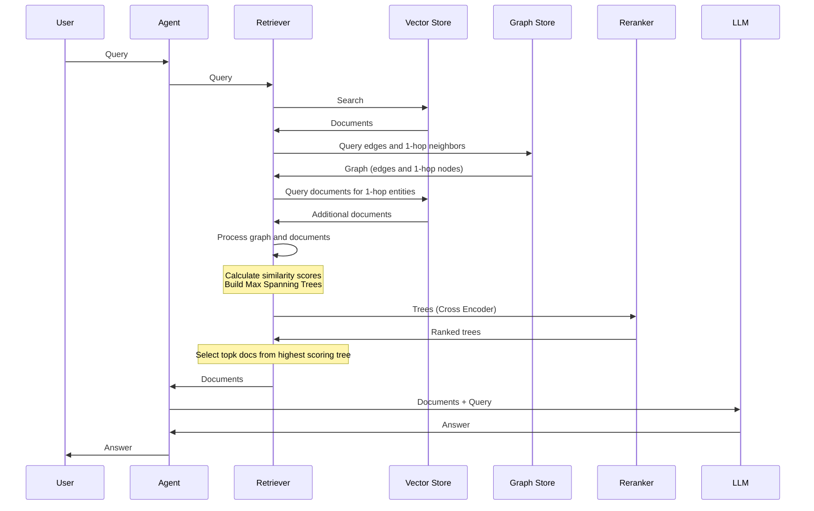

```mermaid
sequenceDiagram
    participant User
    participant Agent
    participant Retriever
    participant VectorStore as Vector Store
    participant GraphStore as Graph Store
    participant Reranker
    participant LLM

    User->>Agent: Query
    Agent->>Retriever: Query
    Retriever->>VectorStore: Search
    VectorStore->>Retriever: Documents
    Retriever->>GraphStore: Query edges and 1-hop neighbors
    GraphStore->>Retriever: Graph (edges and 1-hop nodes)
    Retriever->>VectorStore: Query documents for 1-hop entities
    VectorStore->>Retriever: Additional documents
    Retriever->>Retriever: Process graph and documents
    Note over Retriever: Calculate similarity scores<br/>Build Max Spanning Trees
    Retriever->>Reranker: Trees (Cross Encoder)
    Reranker->>Retriever: Ranked trees
    Note over Retriever: Select topk docs from highest scoring tree
    Retriever->>Agent: Documents
    Agent->>LLM: Documents + Query
    LLM->>Agent: Answer
    Agent->>User: Answer
```
