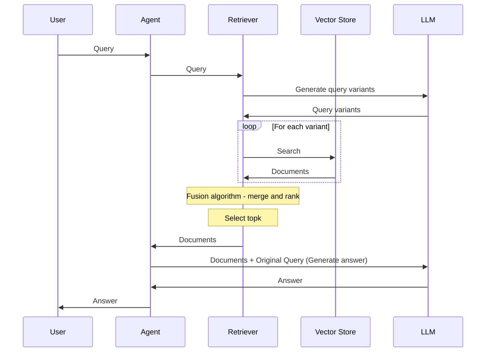

```mermaid
sequenceDiagram
    participant User
    participant Agent
    participant Retriever
    participant VectorStore as Vector Store
    participant LLM

    User->>Agent: Query
    Agent->>Retriever: Query
    Retriever->>LLM: Generate query variants
    LLM->>Retriever: Query variants
    loop For each variant
        Retriever->>VectorStore: Search
        VectorStore->>Retriever: Documents
    end
    Note over Retriever: Fusion algorithm - merge and rank
    Note over Retriever: Select topk
    Retriever->>Agent: Documents
    Agent->>LLM: Documents + Original Query (Generate answer)
    LLM->>Agent: Answer
    Agent->>User: Answer
```
